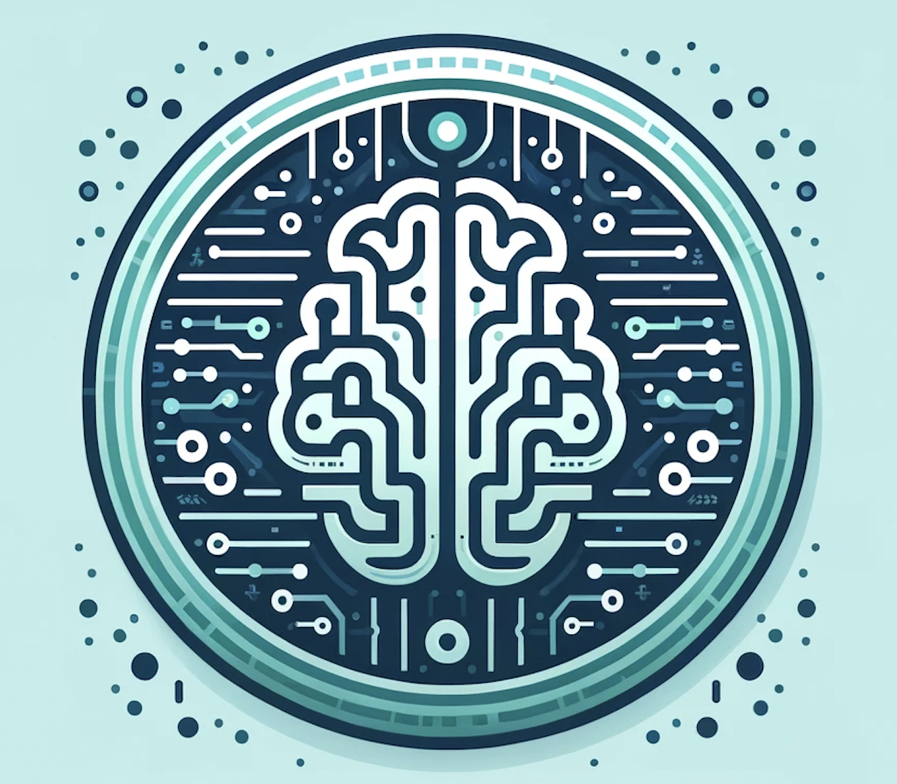

# PASCAL: AI powered unlicensed addiction therapist

## Introduction
Pascal is a friendly and informative therapist powered by OpenAI Assistant API. Its goal is to help people in our server to recover from their addictions, whether it is PMO, cannabis, alcohol, nicotine and other non-life-threatening withdrawals addictions. 

Just to you know, Pascal acts as a first line of help in case of crisis or relapse. If you think your conditions needs to be treated by professionnals, we suggest you to contact addiction treatment facilities in your country.

## Technologies
 - Discord API
 - OpenAI Assistant API
 - logging

## How to use it locally
- You're gonna need a .env file with the necessary keys. Contact vaillancourt.smn98@gmail.com to ask for it. Only approved collaborators can access it.
- You can also use venv in the repo to create the necessary environment -> [How to use venv](https://docs.python.org/3/library/venv.html)

## Logging
A file called bot.log is generated when the bot is used. The necessary informations are there. 

